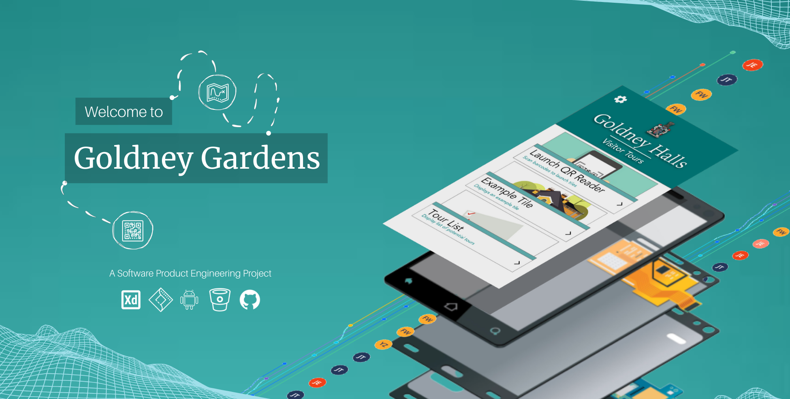

# Overview

As part of our Software Product Engineering second-year module, we have been tasked to develop a software solution for a client in Bristol. This project requires us to adopt agile methodologies partnered with progress and task managing software, namely Jira, to develop a solution to satisfy our client's requirements. This repository documents our source code, documentation and report for our final product - The Goldney Hall app.

### Describing Our Client

###### Our Client
Our client for this project is **The University of Bristol Estates Department Team** whose primary day to day focus is the conservation, maintenance and creation of important botanical and horticultural resources owned by the University of Bristol - one of which being the Goldney Gardens. Our two points of contact are Kasha Smal, historical gardens administrator, and Alan Stealy, Head of External Estates, both of which have extensive knowledge of the Goldney gardens as well as a shared enthusiasm to embrace a technological infrastructure to publicise this knowledge. There currently exists no visitor software, nor public access to the ground therefore it is our client's vision for our app to be the foundation of Goldney's tourism transformation.

###### Interdisciplinary Brief
During the early stages of the development of the app, our clients got in contact with the University's history department and after an initial meeting with senior history lecturer Sam Hitchmough, we saw the potential to include the university's history students. The result in this collaboration saw a change in the solution's design which has been described in 'Our Vision'.

### Describing Our Application Domain / Business Sector
By introducing visitor access to Goldney Hall will contribute to the UK's love for  [Heritage Tourism which is worth in total £20.2 billion](https://www.heritagefund.org.uk/publications/economic-impact-uk-heritage-tourism-economy) and underpins [100,000 jobs in the UK](https://culturehive.co.uk/wp-content/uploads/2013/07/Cultural-Tourism-Key-Facts-and-Figures-resource-2-.pdf). Although there is a significant difference between the scale of Goldney Hall compared to heritage sights such as Stonehenge, Goldney Hall will instead aim to become a socially accredited tourist attraction, overall increasing visitors to the Clifton area and in turn causing positive knock-on consequences to the surrounding community. It is now common practice for heritage attractions to opt for a technological-based tour service over human-lead guides, whether that be a simple tour relying on manual number entering to launch corresponding audio descriptions or autonomous applications that use location-based data points to launch respective information. The success and popularity of these applications have allowed for the history of these sites to be made accessible to the masses, giving Goldney little excuse but to embrace this technological-tour revolution.

### The Key problem
There are intended plans to completely transform the purpose of the grounds, from an events venue/student accommodation, into a full-scale visitor attraction. These plans include renovating the Goldney Building to make the physical building visitor-friendly, however, the current tour process is outdated which significantly limits the reach and accessibility to all potential visitors. Presently, the only way to gain access to the groups and book onto a tour is via a paper-based application form:

* [Existing Tour Booking Infrastructure](http://www.bristol.ac.uk/media-library/sites/external-estate/HG%20Booking%20Form2019.pdf)    

These tours are human lead which results in a group size limitation, a single pace in which these groups are taken around at as well as inflexibility in bespoke areas of interest for the individuals. Our task is to modernise the current, obsolete tour process to encourage all visitors to access the gardens freely while removing existing limitations to allow these grounds to be accessible to the wider community. The greatest **challenges** and **difficulties** we anticipate for this project are facilitating a solution that covers the requirements for all potential stakeholders. An attraction such as Goldney Hall covers a broad scope of people, all with different technological literacy, accessibility limitations and interests, therefore, we feel the success of our solution is dependent on how well it caters for as many stakeholders possible. An additional **challenge** we envision is our ability to compromise between our client's requirements and what is technically feasible given the projects time frame and our developing abilities.

### Our Vision
In an effort to encourage members of the public to enjoy the gardens without a human tour guide, we envision a virtual tour app that will guide visitors through the grounds. Our solution for this project will be interactive, allowing users to access educational texts, stories, and videos via tagged QR codes around the garden via their phone. However, by collaborating with these history students to provide us with the content for our application has incentivised a change in our vision. We now see the opportunity to create two front-ends, one to allow these History students to provide us description and image data (a web-based platform) and the other to display this information to visitors (an app-based platform). What is greatly advantageous about this solution is that once set-up and managerial instructions are provided, this solution will be completely self-supporting (assuming no bugs occur).
