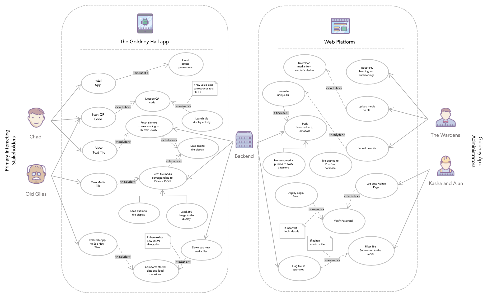

# Requirements

## Stakeholders

###### Goldney App Administrator | Interacting Stakeholder

* **The Wardens |** (tile information providers) history students at the University of Bristol aged 18-25 with a rich knowledge of artefacts and places of interest within Goldney Gardens. The Wardens would love to further explore the history of this heritage gem and share their findings with everyone who wishes to enter the grounds but does not currently have the means to do so.

* **Kasha and Alan |** (the administrators) Kasha and Alan are the heads of External Estates and our client for this project. They are responsible for the maintenance of the app, including moderating the title contents and installing the required physical infrastructure for newly added tiles.

###### Goldney Visitors using the App | Interacting Stakeholder

* **Little Timmy |** (children/school children) A pupil aged 6-11 on a local primary school trip or child visiting with their family. Little Timmy would like to find out about the history of Goldney for either a school project or to keep entertained during their visit by keeping engaged while learning in a child-friendly way. Little Timmy has a developing technological literacy and it familiar with the use of applications primarily for gaming.

* **Chad |** (teenagers) An older teenager visiting the grounds aged 12-18 as part of a college trip or with family. Chad is very technologically literate but is also lazy therefore wants to remove any manual requirements in order to find out about the history of Goldney Gardens.

* **Jane |** (adults) A 30-year-old woman living in the local area. Jane has walked past Goldney Hall her whole life but has never had the opportunity to visit it. She has good technical literacy and is mainly familiar with messaging applications and emails.

* **Old Giles |** (elder generation) – elderly history and national trust enthusiast who is excited to find out more about the secrets of Goldney Hall. Giles often visits nearby heritage sites where he usually opts for a human lead tour where he can ask questions and listen along, meaning he does not need to read anything. Giles is not very technologically savvy and has only recently purchased a smartphone which he uses to call his family and use the occasional application. Giles also has a mobility impairment but does not wish for this to affect his visit to the gardens.

* **Students |** (student resident of Goldney Hall) first-year students at The University of Bristol, typically aged around 18-20 who fall between our Teenager and Adult stakeholders. This stakeholder typically spends a lot of time on this land however, is unaware of its history.

###### Other | Non-Interacting Stakeholder

* **John Smith |** (Goldney visitor not using the app) A visitor of the app that can fall in the persona of any of the Goldney Visitors, however, opts to not take a tour of the grounds. John Smith wishes to enjoy the gardens without being distracted or troubled by others taking tours or any physical infrastructure the tour may need.

* **Albert |** (the gardener) Albert has worked as a gardener at Goldney Hall for over 27 years now and could name every flower and shrub within the grounds. He is keen for visitors to enjoy the gardens as much as he does but does not want to be disturbed by any physical infrastructure and does not want the increased in footfall in busy parts of the gardens to affect the plants and wildlife.

* **Boris |** (GDPR) Boris works at the Information Commissioner's Office (ICO) and is an enforcer of GDPR guidelines which ensures all personal data is stored, used and handled lawfully.

### User Case Diagram

## Functional Requirements

### Minimum Viable Product | Chad's User Story

#### User Requirements

As a 12-18-year-old school pupil, who is technologically literate...

| Requirement Number    |    ... I want to...     |                        ...so that...   |
| :-----                |    :-------------:      |                                 -----: |
|  1.                   | ... be able to easily and quickly install the Goldney Application onto my device ...       | ... I am ready to explore the gardens freely without having to download/install anything in the future.                 |    
|                       |                                                                                            |                                                    |       
|  2.                   |  ... scan QR codes quickly with my phone ...                                              | ... I can instantly access data without manually entering information             |         
|                       |                                                                                            |                                                    |  
|  3.                   | ... see a set of media tiles ...                                                           | .... I can learn about places of interest within Goldney gardens                 |
|                       |                                                                                            |                                                    |  

### Requirement Solutions

##### Requirement 1 Solution | Easy and quick first-time installation of application onto own device

1. The user downloads and launches the Goldney Tour Guide app.
2. The app asks for permission to access the camera.
3. Upon startup, the user is greeted with a splash screen.
4. The user is now greeted with a menu screen.

###### Alternative Flow

2.a - The user declines the app's permission to access the camera.

2.b - The QR scanner requests permission each time the activity is launched.

3.a - The user presses the back navigation button on the splash screen. App exits. User case ends.

###### Exceptional Flow
2.a - There is no camera functionality on the phone. Permission may be granted but camera functionality is not present.

##### Requirement 2 Solution | Scan QR quickly

1. From the menu, the user presses to open the QR scanner.
2. Navigation activity closes and the QR code scanner activity is launched.
3. The camera view is output to the screen. The user may now point their phone at a QR code.
4. A QR code is detected by the app and its raw value is decoded.
5. Raw value is bundled into an activity transition. The Tile Display activity launches and the QR reader closes.
6. The Tile Display activity launches

###### Alternative Flow
3.a - The user presses the navigational back button on their phone. App returns to the menu.

###### Exceptional Flow
2.a - User has not granted camera permissions. The QR reader activity does not launch. User case ends.

4.a - The QR code is not detected despite there being an in-camera focus. The user must dolly the camera to find a new view.

##### Requirement 3 Solution | Display Tile With Text and Static Media

1. The Display Tile Activity is launched with a bundled ID value.
2. JSON dictionary is searched for an entry with the corresponding ID.
3. The tile's title and description are read from the dictionary and set in the display header and tile body.
4. Image media files loaded from an internal directory to the tile display.

###### Alternative Flow
1.a - The user presses the navigational back button. App returns to QR scanner.

4.a - There are no image media sections. No images are displayed.

###### Exceptional Flow
1.a - There is no bundled ID value. Tile body is shown to the user. Error message displayed.

2.a - The ID does not exist in the dictionary. Tile body is shown to the user. Error message displayed.

3.a - There is no title or description in the dictionary. Default title and description shown.

3.b - There is no text set in the section. Section textbox left empty.

4.a - Image media cannot be loaded/located. Image is not shown. Error message displayed.

##### Summary
The core and underlying idea for our application is to be able to view content about points of interest through scanning QR codes. This is why it is the primary objective for deployment within the minimal viable product. A user should be able to scan and retrieve data about pre-defined points of interest around Goldney gardens. For the minimum viable product, this data needn’t be accessed online.

In order to implement these requirements, we have utilised the following technologies:

*    QR code scanner
*    JSON interpreter

### Beta Release | The Warden's User Story

#### User Requirements

As a group of History students with a passion for sharing the history of Goldney hall ...

| Requirement Number    |    ... I want to...                                                                        |                                    ...so that...   |
| :-----                |    :-------------:                                                                         |                                             -----: |
|                       |                                                                                            |                                                    |   
|  4.                   | ... have the app work without a constant internet connection ...                           | ... I do not need to roll out wifi throughout the gardens.                       |    
|                       |                                                                                            |                                                    |  
|  5.                   | ... relaunch the application and see new media tiles ...                                   | ... visitors are kept up to date with our new findings every time they visit.    |         
|                       |                                                                                            |                                                    |  
|  6.                   | ... easily add new tiles to the tour guide app ...                                         | ... I can update tiles whenever I want with new content for the app.             |
|                       |                                                                                            |                                                    |  

##### Requirement 1 / 4 Solution | Easy and quick first-time instalment of application onto own device, with update client

1. The user downloads and launches the Goldney Tour Guide app.
2. The app asks for permission to access the internet.
3. The app asks for permission to access the camera.
4. Upon startup, the user is greeted with a splash screen which holds our internal content update client.
5. The update client checks to see if there is a JSON dictionary of tiles in the local datastore. Since this is the first startup, there is not.
6. The user chooses to update. Updater sends a get request to our server for a JSON dictionary of tiles.
7. Each section of the JSON dictionary is read to download any linked media from the AWS server.
8. The user is now greeted with a menu screen.

###### Alternative Flow
6.a - The user does not choose to update. The factory default tile data is loaded to the device.

6.b - Associated default media is loaded to the device. Nothing is downloaded.

###### Exceptional Flow
2.a - The user declines the app's permission to access the camera and download external files. The app does not update via the internet and uses default data.

3.a - The QR scanner requests permission each time the activity is launched.

5.a - The app tries to requests a new JSON dictionary from the server.

7.a - The download fails. The update client uses the factory setting for the tile.
7.b - A failure message dialogue is displayed. User case ends.

##### Requirement 5 Solution | Automatically fetch and download new media files for the Nth-time the app is launched

1. The user launches the Goldney Tour Guide app.
2. Upon startup, the user is greeted with a splash screen which holds our internal content update client.
3. The update client checks to see if there is a JSON dictionary of tiles in the local datastore. Since the updater has run before, the file exists.
4. The updater sends a get request for a new dictionary.
5. The new dictionary is compared to the stored dictionary and differences are identified.
6. Each section of the JSON dictionary is read and new media files are downloaded.
8. The user is now greeted with a menu screen.

###### Alternative Flow
5.a - There are no changes in the dictionary; no new media is downloaded. Continue to the menu screen.

6.b - Associated default media is loaded to the device. Nothing is downloaded.

###### Exceptional Flow
3.a - The JSON dictionary does not exist. Request a new one from the server.

3.b - Get request failed. Load default data.

4.a - Get request failed. Load default data.

4.b - Display error toast.

6.a - The download fails. The update client uses the factory setting for the tile.

##### Requirement Solution 3 / 5 | Display Tile With Downloaded Resources

1. The Display Tile Activity is launched with a bundled ID value.
2. JSON dictionary is searched for an entry with the corresponding ID.
3. The tile's title and description are read from the dictionary and set in the display headers.
4. Each section object in the JSON entry is read. Text is set in the tile.
5. Image media files loaded from an internal directory.
6. Audio media files are loaded and played.
7. Any panoramic image can be viewed through a button.

###### Alternative Flow
4.a - There are no section objects. No sections are displayed.

5.a - There are no image media sections. No images are displayed.

6.a - Audio media does not exist. Audioplayer is not shown.

7.a - Panorama media does not exist. No buttons are created.

###### Exceptional Flow
1.a - There is no bundled ID value. Tile body is shown to the user. Error message displayed.

2.a - The ID does not exist in the dictionary. Tile body is shown to the user. Error message displayed.

3.a - There is no title or description in the dictionary. Default title and description shown.

4.a - There is no text set in the section. Section textbox left empty.

5.a - Image media cannot be loaded/located. Image is not shown. Error message displayed.

6.a - Audio media cannot be loaded/located. Audioplayer is not shown.

##### Requirement 6 Solution | Upload tile with media
1.    The user accesses an online tile creation form.
2.    Clicking the add tile button allows for a new point of interest to be created. Input boxes are displayed to the user
3.    The user enters a title and subheading for a new tile.
4.    The user clicks the 'add new text section' button.
5.  Two input fields are created; a subheading and a text body.
6.  The user enters text and hits confirm to add the new section.
7.  The user then clicks 'add new image section' button
8.  An image upload box is displayed.
9.  The user drags and drops an image into the upload box.
10. A confirmation toast is displayed.
11. The user finalises the tile and clicks submit.
12. A unique identification number is created for the tile.
13. The tile is pushed to the Postgres database.
14. Any non-text media is pushed to the AWS datastore.
15. A confirmation success toast is displayed to the user. End-use case.

###### Alternative Flow
4.a - The user the clicks 'add new image section' button instead of text section.

4.b - Steps 8 - 10 are followed

9.a - The user clicks the file upload box to manually locate an image via an open file dialogue.

11.a - The user chooses to add another section.

11.b - Steps 4 - 6 and 8 - 10 may be repeated.

###### Exceptional Flow
3.a - There user dose no enter a title nor subtitle. No text will be displayed in-app.

10.a - Image upload failed. An upload failure toast is displayed.

15.a - Any uploads, Postgres, or AWS pushes have failed.  A confirmation failure toast is displayed to the user. End-use case.

##### Summary

The ability of The Wardens to create their own points of interest is of high importance. Without this ability, data within the app will be static and cannot be maintained as Goldney grows and changes.

The ability to add new tiles is hosted in a react based webapp hosted at goldneyhall.com. Information is entered and pushed to our Postgres database. Image media is uploaded to an Amazon Web service datastore.

The app requests a local copy of the tile data in the form of a JSON dictionary whenever it has a stable internet connection. This contains links to external media. External media is asynchronously downloaded using an update client.

Scanning a tile’s QR code returns a unique key, which will, in turn, is used to query a locally cached datastore. Relevant tile media is then loaded and displayed.

In order to implement these requirements, we have utilised the following technologies:

*    Online QR code generator
*    PostGre database
*    AWS EC3 Datastore

### Final Release | Old Giles and Kasha & Alan's User Stories

#### User Requirements | Old Giles

As an older visitor to the gardens who has mobility issues...

| Requirement Number    |    ... I want to...                                                                        |                                    ...so that...   |
| :-----                |    :-------------:                                                                         |                                             -----: |
|  7.                   | ... see the grotto without having to traverse the dangerous stairs...                      | ... I am not at risk injuring myself while still being able to find out its history        |   
|                                     |                                                                                                                 |                                                          |
|  8.                   | ... listen to an audio description of the garden’s points of interest ...                  | ... I can experience the gardens without having to read the text on my phone screen.|
|                                     |                                                                                                                 |                                                          |  
|  9.                   | ... be able to intuitively use the application ...                  | ... I am not limited by my technological literacy when exploring the gardens |

#### User Requirements | Kasha & Alan

As an administrator of the Goldney App and key estates team member...

#### User Requirements

| Requirement Number    |    ... I want to...                                                                        |                                    ...so that...   |
| :-----                |    :-------------:                                                                         |                                             -----: |
|  10.                   | ... let visitors see the grotto even when it is (usually) shut    ...                      | ... the grotto may be seen by more people.         |    
|                       |                                                                                            |                                                    |       
|  11.                  | ... filter the tile submissions to the server ...                                          | ... we can filter any incorrect or offensive tile content.                |         
|                       |                                                                                            |                                                    |
|                       |                                                                                            |                                                    |       
|  12.                  | ... be provided extensive documentation and user guides ...                                          | ... I can confidently manage the platform without running into problems I cannot handle                |       

##### Requirement Solution 7 / 10 | Display tile with downloaded resources, including panorama

1. The Display Tile Activity is launched with a bundled ID value.
2. JSON dictionary is searched for an entry with the corresponding ID.
3. The tile's title and description are read from the dictionary and set in the display headers.
4. Each section object in the JSON entry is read. Text is set in the scroll view.
5. Image media files loaded from an internal directory to the tile display scroll view.
6. Audio media files are loaded from an internal directory to the nested audio player.
7. Any panoramic image link is enabled in a button and set to the scroll view.

###### Alternative Flow
4.a - There are no section objects. No sections are displayed.

5.a - There are no image media sections. No images are displayed.

6.a - Audio media does not exist. Audioplayer is not shown.

7.a - Panorama media does not exist. No buttons are created.

###### Exceptional Flow
1.a - There is no bundled ID value. Tile body is shown to the user. Error message displayed.

2.a - The ID does not exist in the dictionary. Tile body is shown to the user. Error message displayed.

3.a - There is no title or description in the dictionary. Default title and description shown.

4.a - There is no text set in the section. Section textbox left empty.

5.a - Image media cannot be loaded/located. Image is not shown. Error message displayed.

6.a - Audio media cannot be loaded/located. Audioplayer is not shown.

##### Requirement Solution 7 / 10 | View 360-degree panorama of the grotto from outside
1. Launch Panorama View - the Display Tile Activity has been launched as per Requirement Solution 7 / 9.
2. A panorama image section button has been created in the scroll view.
3. The user presses the panorama view button.
4. Panorama image path is bundled with intent. Display Tile activity closes. Panorama activity launches.
5. Panorama activity locates and loads the panorama ball image.
6. Phone display is locked to the landscape.
7. Gyroscope controls are enabled.

###### Alternative Flow
4.a - User presses back navigation button. App returns to Tile Display activity.

5.a - Image is not stored in panorama ball format. Image is displayed but may appear warped.

###### Exceptional Flow
4.a - There is no bundled path value. No image is displayed. Error Message is output.

5.a - The panorama image cannot be loaded/located. No image is displayed. Error Message is output.

##### Requirement Solution 9 | Intuitively navigate the app

See non-functional usability requirements.

##### Requirement Solution 8 / 10 | Upload tile with panoramic images and audio
1.    The user accesses an online tile creation form.
2.    Clicking the add tile button allows for a new point of interest to be created. Input boxes are displayed to the user
3.    The user enters a title and subheading for a new tile.
4.  The user then clicks the 'add audio' button.
5.  An audio upload box is displayed.
6.  The user drags and drops an audio clip into the upload box.
7.  A confirmation toast is displayed.
8.  The user then clicks 'add panorama' button.
9.  A panorama upload box is displayed.
10. The user drags and drops a panorama into the upload box.
11. A confirmation toast is displayed.
12. The user finalises the tile and clicks submit.
13. A unique identification number is created for the tile.
14. The tile is pushed to the Postgres database.
15. Any non-text media is pushed to the AWS datastore, returning a unique resource identifier.
16. A confirmation success toast is displayed to the user. End-use case.

###### Alternative Flow
4.a - The user the clicks 'add new image section' button instead of the text section. Follow standard image procedure detailed in Requirement Solution 7

4.b - The user the clicks 'add new text section' button instead of the text section. Follow standard text procedure detailed in Requirement Solution 7

6.a - The user clicks the audio upload box to manually locate an image via an open file dialogue.

11.a - The user chooses to add another section.

11.b - Standard section procedures may be followed.

###### Exceptional Flow
3.a - There user dose no enter a title nor subtitle. No text will be displayed in-app.

7.a - Audio upload failed. An upload failure toast is displayed.

7.b - User retries upload.

7.c - Upload retry fails. End-use case.

11.a - Panorama upload failed. An upload failure toast is displayed.

11.b - User retries upload.

11.c - Upload retry fails. End-use case.

15.a - Any uploads, Postgres, or AWS pushes have failed.  A confirmation failure toast is displayed to the user. End-use case.

##### Requirement Solution 11 | Moderate tile submissions
1.    The administrator enters a username and password to access a secure online tile review form.
2.  All currently active tiles are displayed as well as tiles pending approval.
3.  The administrator clicks on a pending tile for an approval.
4.  The tile contents are displayed. The administrator reviews the tile.
5.  The administrator approves the tile.
6.  A confirmation toast is displayed.
7.  A flag is set in the database. This tile is now live and may be viewed by the mobile app.

###### Alternative Flow
1.a - Login details fail. Administrator may retry.

1.b - Administrator does not know their login details. End-use case.

5.a - The Administrator decides that the tile content is unsuitable and amends its content.

5.b - The Administrator clicks the 'update' button.

###### Exceptional Flow
2.a - There are no tiles that have been uploaded. This page is simply useless. End-use case.

##### Requirement Solution 12 | Provided adequate documentation

See non-functional usability requirements.

##### Summary
The lack of disabled access to the Goldney Grotto is an issue the estate's team wish to resolve. Since the grounds are grade II listed, it is not possible to retrofit the grotto with wheelchair access ramps or large handrails. As a result, it has been suggested to make use of an array of 360-degree cameras to capture the grotto’s interior. These images should be viewable upon scanning a specialised QR code by the entrance, allowing the user to see the inside through their phone’s screen by orienting it where they wish to look. The 360-degree images could be strung together in a path, allowing the user to ‘walk’ between multiple views.

Tile submissions are moderated by an administrator to the app, preventing incorrect or offensive uploads.

Audio narrations may be uploaded on a per-tile basis to support accessibility features.

In order to implement this feature, we have utilised:

*    Gyroscope sensor libraries.
*    360-degree image viewing libraries.
*    Audio playback technology

## Non-Functional Requirements

### Usability Requirements

Nielsen heuristics are 10 general principles used in heuristic evaluation, a usability engineering method, as a general rule of thumb for all good interactive devices to follow. The following highlight 5 of these primary heuristics our solution should adhere to:

1. **Aesthetic and minimalist design** - the app should be intuitive and contain only relevant information. The user should be able to comfortably navigate the applications core functions after 5 minutes of being introduced with the application. This time period is enough for a visitor to experiment with these functions close to the Goldney visitor centre, and therefore able to easily ask for any assistance, before independently exploring the gardens.

2. **Match between system and the real world** - the app will use natural language and follow familiar real-world conventions (for example, large texts will be organised using standard heading and subheadings). To ensure this, the ability for admins to filter tiles prior to release will allow a common standard to be enforced.

3. **Flexibility and efficiency of use** - navigation design will follow familiar design practices that users should recognise allowing for usage efficiency from the start. Where possible, the user should have 2 different methods to access information, for example, access to tiles could be accessed via QR code scanning or tile selection in a list while information could access both by reading text provided or through supporting audio. Different flexibilities have been described in alternative and exceptional flows.

4. **User control and freedom** - users should be able to freely use the application without the fear of reaching a dead-end or breaking the app. Where possible, functions should be accompanied with reverse exit functions to allow users to undo unwanted selections.

5. **Help and documentation** - appropriate documentation will be provided for respective stakeholders alongside the software's deployment. This documentation will cover a succinct, easy to follow set of instruction that assumes no prior technical literacy.

### Availability Requirements

**The application should be accessible to the public** - the app should be downloadable from a publicly available platform such as the Google Play Store removing the financial strain of supplying devices for all visitors for our clients.

The app should run on Android devices with **Android 6** onwards.

### Accessibility Requirements

**The application should be disability-friendly** - by adopting standards advised by the *Disabilities Act of 1990*, an act that prohibits discrimination individuals with disabilities, our solution can be made accessible for all users. Standard practices such as including alt text for images and providing accompanying audio significantly increases the accessibility for common, restrictive impairments. Since Android are in support of this act, we can utilise the disability tools provided when developing the software. Baseline requirements our application should support:

  * Do not require the use of a pointing device
  * Provide alternative text for images
  * Allow a native screen magnifier to magnify a select part of the screen
  * Allow a native screen reader to read a loud displayed information

### Performance Requirements

1. **Tiles should be loaded and displayed within 3 seconds of scanning a QR code** - as indicated by [this article that analysed the effect of page loading time,](https://www.machmetrics.com/speed-blog/average-page-load-times-websites-2018/) it was discovered that 53% of people will leave a mobile page if it takes longer than 3 seconds to load. This is, therefore, a suitable benchmark to aim to achieve.

2. **Interactive elements should respond in 500ms** - to ensure an [average](https://siftware.com/understanding-web-app-performance-and-usage/) level of interactive feedback for page loading.

3. **Scroll command should respond in < 1s** - this is the duration for the user to notice a delay however their [flow of thought is uninterrupted](https://www.nngroup.com/articles/response-times-3-important-limits/) therefore an appropriate benchmark to aim for.

### Security Requirements

**All communications should take place over secure HTTPS channels** - ensuring the security of our system should be fairly simple. The software should not be handling any sensitive or personal data, therefore a data breach would be inconsequential. Nevertheless, all net communication should take place over secure https channels.

### Paramount Goal | Chad User Requirements

###### User story | Functional Requirements & Non-functional Requirements

Chad is an older teenager, aged 12-18, visiting the grounds as part of a college trip or with family. He is very technologically literate but is also lazy therefore wants to remove any manual requirements in order to find out about the history of Goldney Gardens. As a user of the app, he would like to be able to easily and quickly install the Goldney Application onto his device so that he is ready to explore the gardens without having to download/install anything in the future. He also wants to be able to scan QR codes quickly with his phone so that he can instantly view this tile's information allowing him to learn about different places of interest within Goldney Gardens.

Chad has a short attention span and therefore expects the information for his chosen point of interest to be loaded and displayed within 3-seconds of scanning the QR code, otherwise, Chad will get impatient and give up on the application. Chad's laziness means that as he explores the gardens he is not willing to go out of his way to scan a QR code, therefore the ability to scan them from a variety of distances and angles will allow Chad to view more tiles. He is used to playing arcade-style games and browse social media on his phone and would expect a similar response time otherwise a poor performance efficiency will be noticeable and frustrating for him.

###### Functional Requirements Summary
* The app must download quickly on the Wi-Fi provided by Goldney Visitor centre
* The app must download all material required for any chosen tour
* The app must be able to scan QR codes
* The app must be able to decode the data encoded in a QR code pattern
* The app must search through tiles using a key whenever a QR code is scanned
* The app must present the respective stored text and media for the scanned QR code

###### Non-functional Requirements Summary
* Tiles should be loaded and displayed within 3 seconds of scanning a QR code
* QR codes should be able to be read from a variety of distances and angles
* The app must perform efficiently such as to not hinder performance while loading tiles
* The QR code should call its detection algorithm at a suitable rate such that it is not a performance detriment

###### Basic Flow
1. From the menu, the user presses to open the QR scanner.
2. Navigation activity closes and the QR code scanner activity is launched.
3. The camera view is output to the screen. The user may now point their phone at a QR code.
4. A QR code is detected by the app and its raw value is decoded.
5. Raw value is bundled. The Tile Display activity launches and the QR reader closes.
6. The Tile Display activity launches

###### Alternative Flow
3.a - The user presses the navigational back button on their phone. App returns to the menu.

###### Exceptional Flow
2.a - User has not granted camera permissions. The QR reader activity does not launch. User case ends.

4.a - The QR code is not detected despite there being the in-camera focus. The user must dolly the camera to find a new view.

###### Atomic Requirements Summary
* The app must be able to access the phone's camera
* The app must be able to output camera feedback to the screen
* The app must be  able to retrieve data encoded in QR format
* The app must be able to query a set of tiles by ID
* The app should be able to load a tile in a reasonable amount of time
