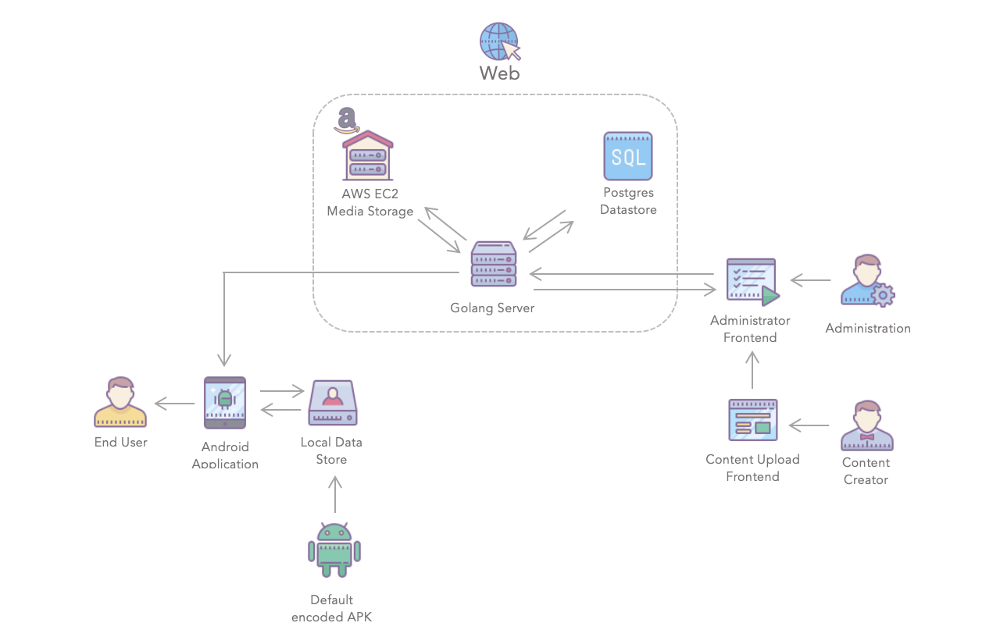
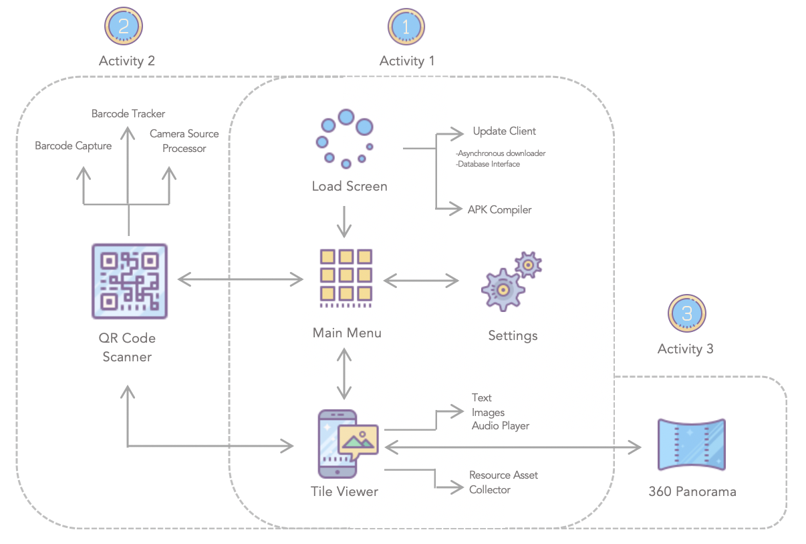
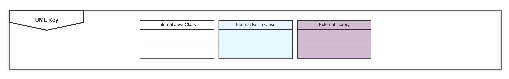
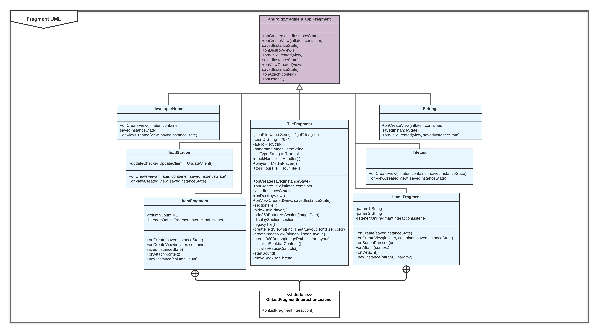
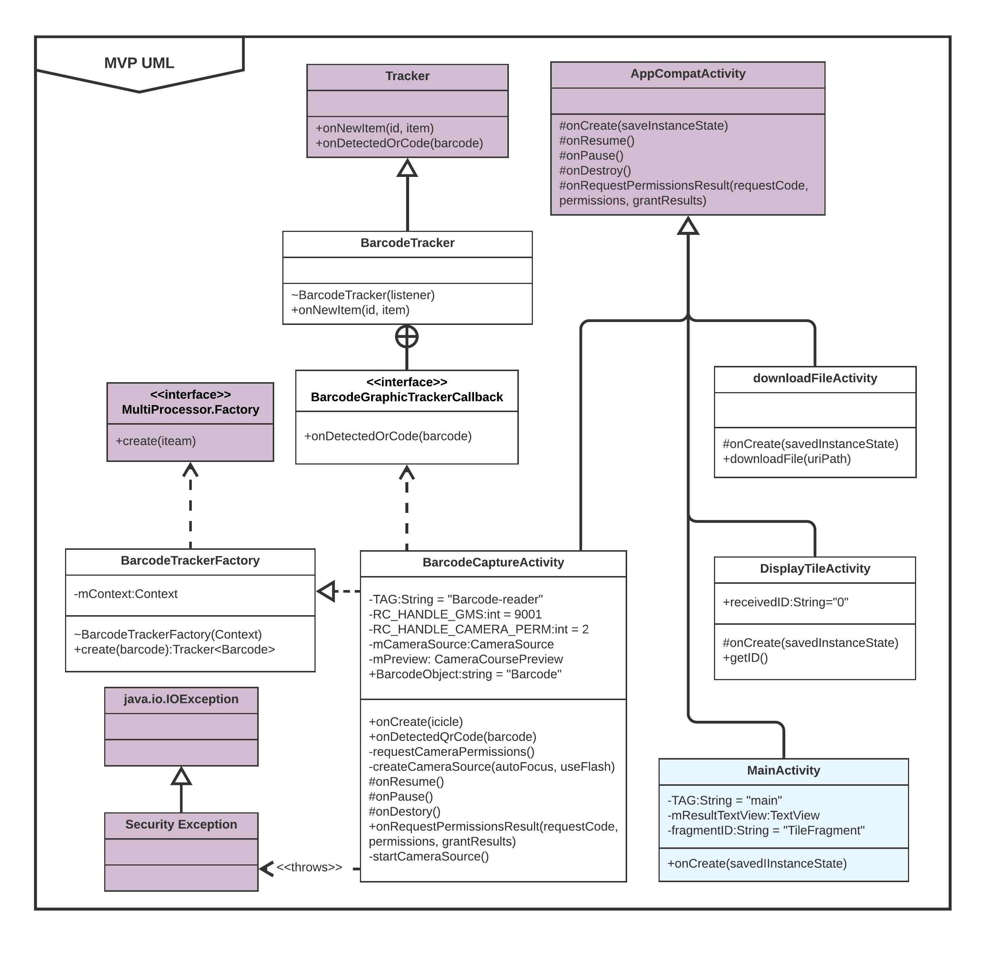
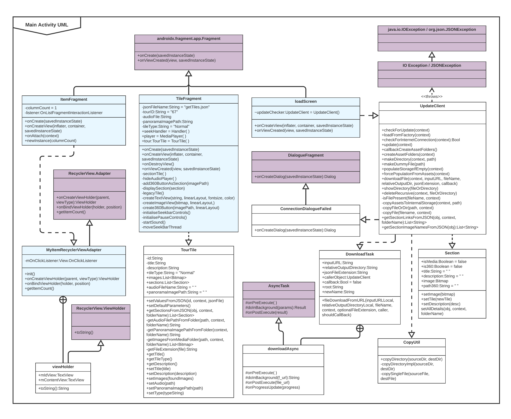
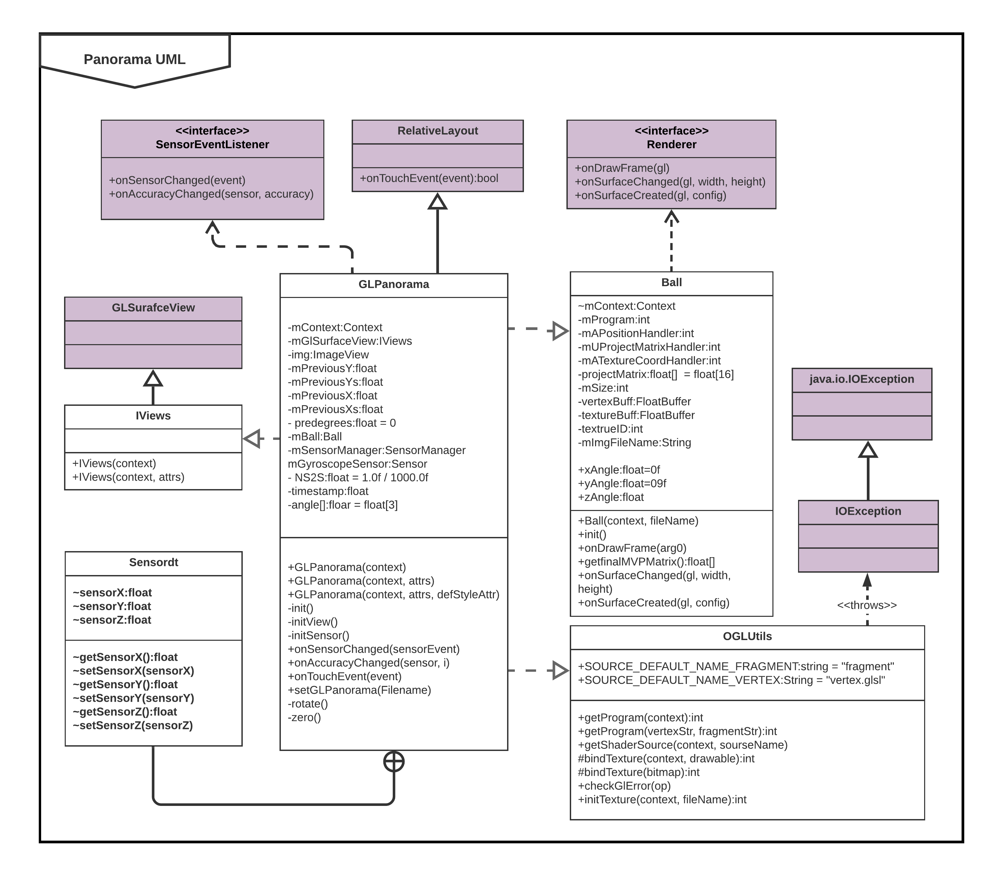
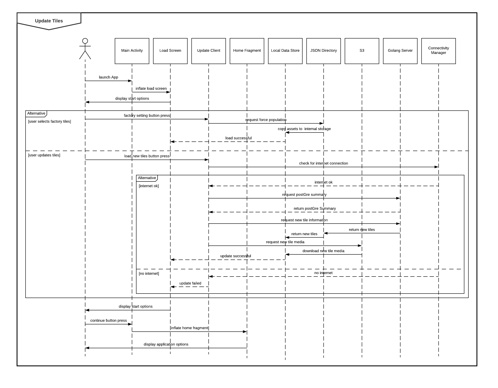

# Architecture

### Master Architecture Diagram

###### Master Architecture Description

**Android Application and Local Datastore |** The application frontend is what will be presented to the end-user. It is, in essence, our app. Through the frontend, visitors to Goldney can scan QR codes to view text, images, audio descriptions, and panoramas of various points of interest. Since Goldney’s grounds do not have complete Wi-Fi coverage, constant and instant communication with a cloud database is not a feasible solution to access our data. As a result, scanning a tile’s QR code returns a unique key, which will, in turn, is used to query a locally cached datastore on the user’s phone – thus allowing near-instantaneous data access without an internet connection. **This is an example of how user requirements have driven architecture decisions**.

**GoLang Server |** The Golang server is used as an interface between the datastores (S3 and Postgres) and the applications as well as handling the authorisation for the admin sections using JWTs. The frontend app will request updates for its locally cached datastore to the Golang server on startup. These could be delivered in the form of a JSON object constructed from the data in an isolated (only accessible through the Golang server) Postgres database. The relatively small size of these updates makes it feasible to check for an update whenever the app has a stable internet connection.

**Postgres Datastore and AWS EC2 Media Storage |** The frontend android app regularly requests updates for its locally cached data store via an internal update client. These requests are the form of a get request to the Golang API. The API then queries the Postgres database and returns a JSON object describing each tile. The relatively small size of these updates makes it feasible to check for an update whenever the app has a stable internet connection. If the newly downloaded JSON object differs from the locally stored version, then any new assets are also requested. These are downloaded directly from the EC2 media store where the assets are stored publicly (this was not an issue with security as these assets would already be public through the app). The frontend app has minimal interaction with the API as its only interface is requesting a new JSON object on startup. The Postgres database contains URI links to access the AWS asset datastore. To prevent unwanted access to the Postgres database, docker was used. This allowed us to keep the Postgres database in an internal network and therefore could only be accessed through the Golang server and admin panel.

**Content Upload Frontend |** In order to **facilitate the user requirements** of the history students, our architecture plan also includes a web interface. We have collaborated with these history students to make it possible for them to add their own points of interest through a web-based content upload form. All the data submitted by the history students is encapsulated within several abstract objects. Every point of interest is modelled as a ‘tile’, which has an associated ID and header data. Each tile’s content is a list of ‘sections’. Sections are a polymorphic object capable of representing several forms of media we may wish to present to the user (eg text, an image, audio). Sections are nested linearly in a tile fragment’s scroll view. Reordering the list of sections allows formatting of the tile – therefore allowing the content uploader design freedoms in how they wish to present their material. Additionally, this method of structuring our data allows it to be easily modelled in a relational database – as each tile has a one-to-many relationship with its child sections. The content upload form makes post requests to Golang server in order to submit the assets and tiles. When an asset is uploaded is immediately send to the Golang server, which saves it to the S3 asset store. [This post request](https://dev.goldneyhall.com/#tag/Tiles/paths/~1uploadImage/post), if successful, returns a link to the image, so this can be stored in the section/tile data.

**Administrator Frontend |** The Administrator Frontend is a react website. From here, a system administrator is able to view all tiles stored in the database, as well as have the ability to approve and amend submitted tiles by the history students. The admin panel makes a request to secured endpoints of the Golang server in order to [update tiles](https://dev.goldneyhall.com/#tag/Tiles/paths/~1updateTile/post), [delete sections](https://dev.goldneyhall.com/#tag/Tiles/paths/~1deleteSections/post) and [set a tile activity](https://dev.goldneyhall.com/#tag/Tiles/paths/~1toggleActiveTile/post) (active tiles are displayed on the app, non-active are not). These endpoints are secured using JSON web tokens to prevent unauthorised users from carrying out these actions. In order to obtain a token, a user must visit the /Login page and give the correct admin username and password. A salted and hashed password is stored in the Golang server directly for the admin account as it should not need to be changed often.

A potential feature of our system’s architecture is an admin mobile app. Providing there is an internet connection, this app should provide the end-user with an intuitive way to add new points of interest to the cloud database. In theory, the admin is able to approve a submitted point of interest, print off the newly generated QR code, then plant it in the ground.

### Activity Architecture Diagram

###### Activity Architecture Description

The android app is divided into three main activities, each of which plays host to several fragments. Fragments are lightweight methods of displaying an interface to the user without having to change the application context. Each activity has a layout which contains a fragment docker window. This window may hold any fragment - greatly reducing loading times when navigating menus since similar interfaces are held together in memory. Fragments have introduced an additional layer of complexity to the source code. Since they are a new feature in Android Studio, they are only supported by Kotlin. As a result, the app is written in both Java and Kotlin, with Kotlin used primarily for activity and fragment management due to necessity, whereas Java was used for more complex processes owing to its wealth of existing libraries. In most cases, Kotlin interface scripts will instantiate Java objects to perform tasks.

**Launching the Application** | Upon startup, the app initiates its internal update client. It scans the local datastore for files. If no files exist, then a default set of tile information is unpacked from the APK, populating the app with a barebones selection of information. This also ensures that the app will always function without an internet connection and can be used purely offline. The default files are set in the development environment assets folder. This also creates a JSON dictionary of all tiles, sections, and media.

**Activity 1 |** The updater may now assume that a JSON dictionary exists. If there is currently no internet connection, then the app continues to the main menu and will utilise what data is presently cached. Otherwise, the updater sends a get request to the Postgres database for a new JSON dictionary. The dictionary is then scanned for any media content changes. For each new item of media, the updater reads the corresponding URI (Uniform Resource Identifier) and executes a new concurrent asynchronous download task on a separate processor thread (therefore allowing the user to continue to use the app while an update is being delivered) - calling back to the updater upon their completion.

**Activity 2 |** The QR code scanner is split into three separate groups of classes:

* The camera source processor
* the barcode trackers
* The barcode capturer

The camera source processor manages the image input stream in conjunction with an underlying implementation of Google’s gms vision detection library. This receives preview frames from the camera at a specified rate, sending those frames to the tracker as fast as they can be processed. The barcode trackers are simply the implementation of Google’s image detection software. The capturer’s detection method is called when the tracker recognises an image and successfully converts it into a raw value. When scanning one of our QR codes, the raw value should simply be the primary key of a tile. The tile display activity is called with a bundled intent including this value, asking the displayed fragment to locate and load the associated resources. Due to the fact that the tracker must post-process each frame, this activity suffers from relatively poor performance on most phones. Unfortunately, this is a common issue amongst all image recognition technologies.  

**Activity 3 |** Our client was very keen on allowing visitors to experience Goldney Grotto; an area of the garden that is usually shut off to the public. To accomplish this, we have outfitted the app with a 360-degree panorama media viewer. It makes use of ball mapping technology, warping an image and projecting it to the inside surface of a sphere. The feature is contained within its own separate activity due to the associated resource overhead of keeping the viewer in memory. It may only be accessed via specifically marked 360 media tiles, which present a link to the user to launch the activity with the relevant 360 media. This facilitates the request of the staff at Goldney -  they are able to place a QR code near the grotto to allow visitors to experience its interior without it being open. Furthermore, it enables the less able to see the grotto, since there are currently no accessibility features in the garden. This view makes use of a modified Google API library.

# OOP and UML Design + Diagrams

## Static UML

The purpose of our static UML diagram was to provide visual clarity when designing and developing our application, allowing for ease of executable code construction. Within our solution, there are four distinct modules, namely:

* Fragment design
* Minimum Requirements
* Main Activity
* 360 Panorama

whose context of creation and motivations are described in the following.

#### UML Key

As previous stated, due to opting for the use of fragments instead of creating a new activity to display our interface, has subsequently caused the app to be supported by both Java and Kotlin. Kotlin has primarily been used of activity and fragment management whereas Java classes are used for the core, more complex functionalities aided by the extensive selection of existing libraries that can be utilised. All internal Kotlin classes are highlighted in blue and internal Java classes in white, whilst external libraries have been highlighted in purple.

#### Fragment UML Diagram

 Fragments are highly advantageous as they are able to display an interface to the user without having to change application context, meaning they are a lightweight, more efficient alternative.

 **Context |** The **context** in which this fragment UML diagram was created was to understand the relationship between all required fragments including their dependencies on external libraries. All fragments are child classes of external parent class `Fragment` and therefore inherit all methods and attributes of this class. This diagram, therefore, allowed us to identify the existing methods within the `Fragment` library and in turn determine methods to be overridden for each unique fragment. From a designer's perspective, this allowed for the efficient implementation of menu navigation, since only a small amount of active memory needs to be swapped out of use to navigate to another page. Additionally, fragments are inherently supported by Android Studio's navgraph framework - a visual development environment that allows us as app developers to expand the number of fragments within a closed graph system without writing additional code.

 **Motivation |** Additionally, by including interfaces implementation between crucial classes, satisfied the **motivation** of allowing fragments to communicate with their activity. This is depicted in the UML diagram where classes `ItemFragment` and `HomeFragment` both implement the `OnListFragmentInteractionListener` interface. This allows for fragments to be loaded with a specified set of defined parameters, almost as if they were a method. This is a technology that will undoubtedly be made use of in loading tile fragments from their base activity - providing them with the parameters to display a specified tile's content.

 **Reflection |** On reflection, the inclusion of fragments was a learning process. We had to take it upon ourselves to learn how to make use of a concept that, on the surface, seemed very intuitive. For instance, fragments cannot be displayed purely with their own XML layout like any other object. Instead, they must be held within a specified container in 'master activity layout' XML description. Additionally, since fragments and navgraphs are new additions to Android Studio's development environment, they are implemented using the more recent Kotlin language, rather than Java (which appears to be in deprecation). This made us rely heavily on the fragment communication methods to send data between Kotlin classes and Java objects. However, in the end, this appeared to be worth it; context switching between fragments is nearly instantaneous, therefore fulfilling our responsiveness requirement specification.

#### MVP UML Diagram

###### MVP UML Diagram Description

**Context |** The ability to scan a QR code and retrieve corresponding information is the most fundamental concept for our project and as described in *requirements*, is our paramount goal. Therefore, it was modelling this fundamental concept for our minimum viable product which was the **context** in which this static UML diagram was created, ensuring all of 'Chad's' user requirement was accounted for.

The three key user requirements for our MVP and their influence in the design of this static UML diagram is as follows:

1. **I want to be able to easily and quickly install the Goldney Application onto my device, so that I am ready to explore the gardens freely without having to download/install anything in the future** - This user requirement influenced the choice of architecture, opting for a local datastore over a cloud database, and therefore has not affected the class diagram design choices.

2. **I want to scan QR codes quickly with my phone so that I can instantly access data without manually entering information** - The requirement of QR code scanning is exhibited on the left half of the static UML diagram, where the barcode tracker, barcode capture and camera source processor are designed. This solution requires existing methods from the respective interface and external classes as displayed.

3. **I want to see a set of media tiles so that I can learn about places of interest within Goldney gardens** - Partnered with the design implementation of user requirement 2, in order to then view the corresponding data requires the communication between fragments (covered in the previous UML diagram) and backend architecture.

**Motivation |** The QR code reader class family is designed to be abstracted away from the rest of the app's functionality - namely separate from the menus and tile display activity. This is because it is a complex system that makes use of extensive use of Google vision API libraries. Access to these libraries from other classes could seriously convolute the development process. Furthermore, including the resources and libraries required for the QR reader in the menu activity could seriously hinder the app's performance on low-end devices.
There is little inheritance in this UML diagram. This is because there is not much that needs to follow a modular development flow in this area of the program - the QR code scanner must simply be able to scan QR codes. Instead, the classes should act almost as a pipeline, with the capture activity pushing camera frames to the tracker factory, which in turn returns results via the tracker.

**Reflection |** Upon reflection, it was a good idea to separate the functionality of the QR code scanner from the rest of the app. Tested on a variety of android devices, the scanner was shown to be very demanding of processor resources and (with certain parameters), system memory. This is because each camera frame is captured and sent to a frame buffer queue - where each frame may be analysed for the presence of a QR code via a vision library, then analysed to decode its contents if one exists. Despite this, keeping the scanner functionality separate was a tradeoff decision. It takes a noticeable amount of time to load the scanner activity since multiple objects must be instantiated, however, the load time was still well within 3s as specified in our requirements,

#### Main Activity UML

###### Main Activity UML Description

**Context |** The Main Activity was created to house the navigation menu as well as the app's internal update client. It is the first activity that is loaded when entering the app. As such, all the classes involved should be lightweight to reduce loading times. Furthermore, the update client being shown to the user satisfies several key requirements concerning content delivery.

**Motivation |** The upper internal Kotlin classes in the diagram shows what the user will see as they are the family of classes that the fragments within the Main Activity class. On the other hand, the left subgraphs describe the selection of objects that are related to the loading and saving of resources. It is important that these objects throw exceptions in the case that these resources cannot be found/accessed, otherwise, the app will crash. Finally, the larger right subgraph in the diagram shows the makeup of the asynchronous download process - the class responsible for downloading multiple tile resources from the server. It should be called by the update client whenever a file needs to be downloaded to a destination in internal memory.

**Reflection |** The asynchronous download methods were very effective. It allows for a large selection of files to be downloaded simultaneously without overloading the processor by making use of multiple processing threads. As a result, the update client can download resources in the background as the user continues to use the app. Their inclusion was certainly a learning process, but it has emphasised the use of multi-method coroutines with a start, body, and final callback.

#### 360 Panorama UML

###### 360 Panorama UML Description

**Context |**  360 Panorama image viewing was an optional final release requirement specified by our clients. It fulfils the requirement to allow the less physically able visitors to Goldney to view the grotto without traversing the uneven steps. We created this diagram to show one way how it may be implemented.

**Motivation |** The design behind this part of the app's functionality should be simple. The activity should be launched from a special tile after a user has scanned a certain QR code. The activity should load an image to memory and display it inside a panoramic view display. The app should then make use of sensor and gyroscope controls to manage the orientation of the view. The 360 image should be formatted in the form of a ball. A ball is a commonly utilised VR imaging technique that maps an image to the inside face of a sphere. We chose this because the Department of Computer Science has such a camera in their inventory.

**Reflection |** Panoramic images that are stored as other layout formats (other than balls) can still be displayed, however, they suffer from perspective warping - resulting in either a fisheye or pinch effect. Furthermore, not all phones have a full sensor suite for 3 axes of rotation. As a result, yaw rotation controls were made optional, such that the viewer will function using a compass and accelerometer.

### Dynamic UML: Update Tiles

###### Dynamic UML Description

The above dynamic UML diagram describes the interactivity when the user launches the application.

1.    The user opens the app on their phone, or a phone provided to them by Goldney Hall visitor information.

2. The application starts the `Main Activity` then subsequently inflates the `loadScreen` Fragment within this activity displaying to the user the Goldney Hall Splash Screen.

3. An `updateClient` object is instantiated. It checks for an internet connection via the `connectivityManager` and pings the PostGre server.

4. If there is a connection to our server, then a new `JSON Dictionary` downloaded. The new file is compared to the old file currently in storage. If they differ, then the file is scanned for URI codes which describe the media in our offsite Amazon S3 datastore. This media is downloaded to the `Local Data Store`.

5. If there is not a connection to our server, then the `updateClient`checks if a `JSON Dictionary` exists in internal storage. If it does not, then a default 'factory' set of tile info is loaded from the APK's `assets` folder.

6. The application proceeds to inflate the `Home Fragment` to bring the user to the menu system.

**Context |** This Dynamic UML diagram was created to detail the active flow of steps that are involved in launching the app. The update client is one of the more complex processes in the app, and as such, it is important to show the steps of interaction between various areas of the program from a developer's perspective.

**Motivation |** The Dynamic UML details what is essentially a branching chain of interactions that are initiated by a couple of taps from the user's phone. There is a lot going on behind the scenes in the app. Since there are multiple paths through the UML that can be taken, the diagram describes the design decisions that were made regarding the structure of the updater. We needed to outline the interactions that take place in both the control and alternative flows as set out in the  [beta requirements section](https://bitbucket.org/goldneyar/goldney-ar/src/584295f22a02/Portfolio%20A/02_Requirements.md?at=masterBranch) in order to cover all bases and engineer efficient solutions to our requirements.

**Reflection |** The Update Client - the chain of events described by the Dynamic UML, is an aspect of the application that we are especially pleased with. It effectively abstracts much of the app's complex background work to a simple tap of the update button. Although it has proved challenging to implement, much of the source code within the update class was condensed into reusable methods, therefore allowing us to simply describe a flow of steps using a series of if/else statements. It was a learning process of creating maintainable and modular code; a concept that is very important in software engineering.
