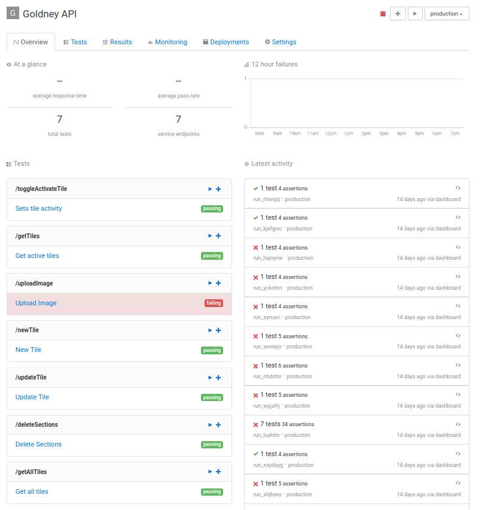
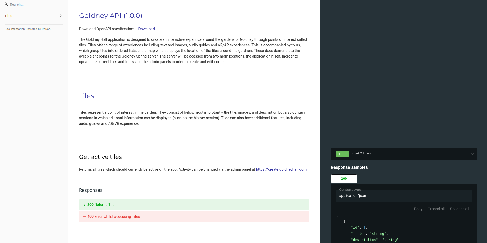

# Development Testing

## Application Testing

#### Repository Information
It is worth noting that development was managed through two repositories. The Bitbucket repository was used to manage builds of the frontend application, whereas two separate GitHub repos housed  backend and server development. This was done to keep repository complexity low as well as reducing the likelyhood of merge conflicts.

#### Strategy and Approach to high-level release
Our aim for our application testing pipeline was to create a system that ran tests on every push of the code and a broader set of tests on every build.

**Initial Plan |** Our initial plan for testing was to use Travis CI. Travis CI is an online CI provider which runs a docker instance on which to run the application. Within this docker, instance tests can be run on the application. The simplicity of Travis CI allowed us to get tests up and running very quickly. However, there were a few limitations to this CI provider. In order to respond to push and versions on git Travis CI required the use of Github rather than Bitbucket. It was also not designed directly for Android which meant the naïve setup we had, had to reinstall the android SDK on every push. Similarly, there were many features which were not designed for the android framework including features that were more difficult to implement. This proved unsuitable as an emulator for UI testing.

**Alternative Solution |** For this reason, we looked for an alternative that had a greater focus on android development. The new option we found was Jenkins. This is an open-source server which could easily be deployed in a docker container making starting a Jenkins server very easy. This also allows us to run the container locally or host it on a server with very little additional configuration. Jenkins offers the full pipeline we required including running tests in response to webhooks from git repositories, android (gradlew) testing and the option to run an android emulator for UI testing.

**Implementation |** Currently we have a Jenkins docker image that contains the various packages we require to run the android application. This is both deployed locally for when we want to run tests locally without pushing and on a Digital Ocean server which in the future will link to our git repository. Unfortunately, this also required the use of GitHub rather than Bitbucket as GitHub provide the required webhooks integrated with Jenkins. The future plan for Jenkins is to set up both unit and UI testing which will run on the digital ocean server after every push to Github. Moreover, it will run a wider set of tests after a push to “release” branch which will be used for the latest version of the next release. We also hope to implement feedback to the git repository so the outcome of the tests is clear from the repository. This testing area relates to the backend database as well as the frontend webapp. 

#### API Testing

Our [Golang server](https://bitbucket.org/goldneyar/goldney-ar/src/master/Portfolio%20A/00_Images/MasterArchitecture.png) strictly followed the OpenAPI specification. During the development phase, we started by writing out the endpoints required in a YAML file, with the corresponding response code, JSON bodies, parameter and descriptions. Using redoc we compiled this YAML file into docs which would be followed throughout the development process to ensure the server was meeting the required specification (the docs can be found here https://dev.goldneyhall.com).  Moreover using this YAML file we could automatically generate tests for our API using assertible. These test exactly matched our specification and docs as they are generated from the original YAML file. These tests carried out requests to each endpoint with given parameters and asserted the response code, JSON scheme and response headers were as expected.

This allowed us to follow test-driven development principles as from the beginning of the development phase we could test the endpoints as they were made to ensure they matched exactly to the desired specification.  

###### Assertible Example

###### API Documentation

As we updated the requirement of our API, we could quickly and easily update the testing and docs before implementing. This allowed us to ensure the API performed exactly as expected. Assertible also allowed us to run tests on the API via our deploy script. This meant every time we deployed a new version the full suite of tests would be run and send an email notification if there were any issues.

## Deployment Pipeline

#### User App

The frontend user app utilises the Java Espresso UI testing framework to manage the execution of unit tests upon pushing a build to the bitbucket repository. To release a live build to the public, we utilise the Google Play Console publishing pipeline. It manages the deployment and publishing of a sequential set of app builds to the public storefront. Multiple pipeline tracks may be created, allowing for the app to be downloaded in its different stages by different testers. The Play Console requires the upload of an APK or app bundle to push an update, therefore there is very little chance of accidentally deploying an unfinished build. 
Furthermore, the user app is the final link in the chain of requesting data from our servers. As such, assertions on the various get requests (for media and dictionaries) act as broad stroke integration tests to ensure the functionality of our entire software platform.
The app itself is divided into [several activities](https://bitbucket.org/goldneyar/goldney-ar/src/master/Portfolio%20A/00_Images/ActivityArchitecture.png) ; major modular components of the app's functionality.  Each activity must be able to communicate with others upon their context switch. Tile ID assertions effectively test the whole flow of activity switching through a series of intents.

#### API and Webpages (create and admin)

For both the API and all the webpages, we used docker-compose and traefik for deployment. This allowed each component to be independent and would make it very easy to migrate to another hosting provider, as the client was unsure whether they would want to use AWS in the future. On our server, we also ran docker images that checked for Github webhooks. These would react once a push was made to a specific branch of the Github repo (the branch for deployment) and would then proceed to pull the changes and rebuild the docker image. This would allow us to simply merge our changes to the correct Github branch in order to deploy changes. Similarly, on every Github push, assertible would run tests on the changes and send an email notification if it found any issues with the deployed API.

## Release Testing

#### Strategy and Approach to high-level release
Testing will be carried out throughout the development process, by our team routinely testing the functionality of the app as new features are introduced. Having said that, the true litmus test for the success of our product is for it to survive a live testing environment with real users. This will be organised for a date just prior to our planned release once all functional requirements have been met. This will enable us to robustly test our non-functional requirements (such as page loading time and download accessibility) as well as highlight any UI issues our app may face on a multitude of devices.

The table below shows the release testing plan for our Minimum Viable Product, beta version and final version.
#### Minimum Viable Product

|                        |                                              |                                |
| -------------          |                 :-------------:              |                        -----:  |
| Camera and QR scanner  | Check our application can use the camera     |     Manually                     |    
|                          | on mobile phone and the QR scanner           |                                |    
|                          | working well in different environments       |                                |      
|                          | ( eg the performance in different light      |                                |      
|                          | level )                                      |                                |      
| QR-Code                | Check all the QR code connect to the correct |     Automatically                |    
|                          | content                                      |                                |    
| User interface         | Check all the buttons lead to correct pages  |     Manually                     |    

#### Beta Version
|                        |                                              |                                |
| -------------          |                 :-------------:              |                        -----:  |
| GPS                    | Make sure our application can get the        |     Manually                     |    
|                          | correct location of users and shows it on    |                                |    
|                          | the map                                      |                                |       
| QR Generator           | Check our in-app QR code generator can make  |     Automatically                |    
|                          | the QR code that contains the information    |                                |    
|                          | we want                                      |                                |    
| Cloud server           | Check our application can connect to our     |     Automatically                |    
|                          | cloud server successfully and users with     |                                |  
|                          | authority can modify the data stored in      |                                |  
|                          | the cloud server (eg add or delete takes     |                                |  
|                          | and tours)                                   |                                |  
| Automatically Update   | Make sure our application can connect to     |     Automatically                |    
|                          | our cloud server and update at a specific    |                                |    
|                          | time we choose                               |                                |    
| Wed database interface | Check our web database interface accepts    |     Automatically                |    
|                          | different kind of data(AR, video, text)      |                                |   

#### Final Version

|                        |                                              |                                |
| -------------          |                 :-------------:              |                        -----:  |
| Augmented Reality      | Our application should be able to show       |     Manually                     |    
|                          | a 360-degree image of the grotto with AR         |                                |        
| Gyroscope Sensor       | Make sure our application can use the        |     Manually                     |
|                          | Gyroscope sensor in the mobile phone. Check  |                                |   
|                          | our application can show the correct view    |                                |  
|                          | of grotto when users moving their phone      |                                |  

|                        |                                              |                                |
| -------------          |                 :-------------:              |                        -----:  |
| Intuitiveness of navigation      | Test subjects should be able to effectively navigate our app without asking for assistance.       |     Live Test|                            |        
| Robustness of update client in a real environment       | Ensure that tile media can be downloaded correctly to users' devices while the media server is under stress.       |     Live Test|
| Audio Accessibility Features                         | Ensure that all users are able to access audio narration features on their device.  |    Live Test                            |   
|       Robustness of QR code reader                   | Ensure that the QR code reader is able to scan and return the correct tile information in outdoor light levels and on a variety of cameras.    | Live Test                               |  
| Ease of Download                         | Ensure that the android app can be downloaded from the Play Store and fully operational within a short time.| Live Test                                |  
                  |  