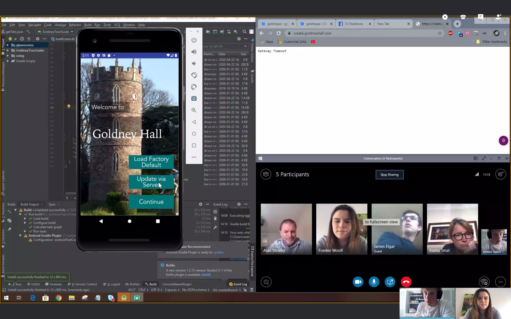

# COVID-19 Statement

#### User Testing

###### Previous Plans
The original plan was to carry out a live release test of the Goldney Tours app with a selection of ~20 volunteers around Goldney Gardens. This would closely mirror the environment in which the app would be used after release.
Due to the Covid-19 pandemic and social distancing guidelines, this approach became unfeasible and irresponsible. Furthermore, all members of our development team are not currently residing in Bristol at the present moment.

###### Alternative Solution
As a result, Jordan set up a miniature use test environment in his garden at home. New tiles were created and populated with information relevant to garden features in order to simulate the default environment.

The live test footage is available [here.](https://www.youtube.com/watch?v=wuClfFS_j-E&feature=youtu.be)
The live test summary is available [here.](https://bitbucket.org/goldneyar/goldney-ar/src/b0690630f61c/Documentation/Live%20Test%20Report.md?at=masterBranch)

#### Client Meetings

###### Previous Practice
Following agile methodologies means frequent client meetings are crucial to ensure client requirements drive the project's development. Therefore our previous practice had us schedule in fortnightly meetings for us, our primary clients Kasha and Alan as well as occasionally welcoming external collaborators to discuss the project development and future aspirations. These meetings allowed us to demonstrate current prototypes, receive iterative feedback and we're essential in the development of our user-centred solution.

###### Alternative Solution
The result of COVID-19 left us all confined to our houses, however, our great appreciation for these client meetings left us very keen to compromise with this geographical barrier. Therefore, to mitigate these effects, we were easily able to schedule online Skype Business meetings allowing us to proceed with prototype demonstrations, albeit through a screen. Although this method is not usually preferable over face-to-face meetings, there were no significant limitations to this meeting arrangement and our regular agenda was able to be met.

#### Working Remotely

Our development team has had to embrace the fact that work must be conducted remotely. This means relying more heavily on digital communication methods (such as Slack). Additionally, the level of documentation in the main GIT repository has largely increased. Commit messages and descriptions allow us to view summaries of the work we have done. Additionally, the use of more advanced techniques such as pull requests have been employed, ensuring that we do not accidentally override each other's work.

We have encountered difficulties in this process, however. Our team member Yuqing has left the country to return home to China and has been unable to contribute to the project.
